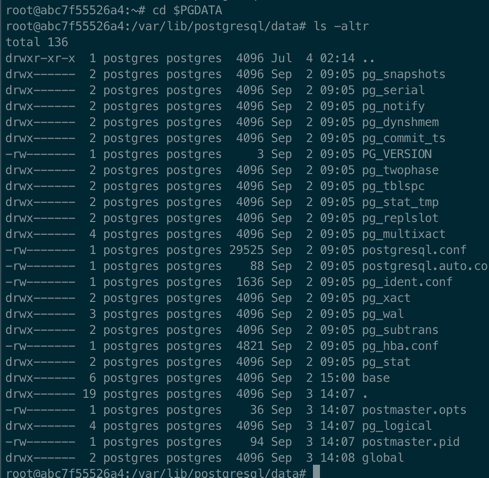

# Internals of Postgres


## Setting up a Postgres DB with docker


```shell
docker pull postgres

docker run --name pg1 -e POSTGRES_PASSWORD=Welcome4$ -p 5432:5432 postgres

docker exec -it CONTAINER_ID /bin/bash
```

## Database Cluster

### Logical DB cluster
Logical DB cluster would include databases, tables, indexes and so on. These are called catalogs
or DB objects.

All the database objects in PostgreSQL are internally managed by respective object identifiers (OIDs), which are unsigned 4-byte integers. 
The objects are - https://www.postgresql.org/docs/current/catalogs.html

```shell
postgres=# SELECT datname, oid FROM pg_database WHERE datname = 'mydb';
 datname |  oid
---------+-------
 mydb    | 24576
(1 row)

## Created a table users in mydb - (id serial primary key, name int)

mydb=# SELECT relname, oid FROM pg_class where relname = 'users';
 relname |  oid
---------+-------
 users   | 32769 
(1 row)
```

### Physical Structure of DB
A db cluster is a file system directory, the **_"base directory"_**.

Layout of DB cluster on Disk -



The definitions can be found here - https://www.postgresql.org/docs/current/storage-file-layout.html

#### Layout of a Database

A db is a directory under "base" folder in PGDATA, with its oid as folder name.
```shell
root@abc7f55526a4:~# cd $PGDATA
root@abc7f55526a4:/var/lib/postgresql/data# ls -ld base/24576
drwx------ 2 postgres postgres 4096 Sep  3 14:32 base/24576
```


